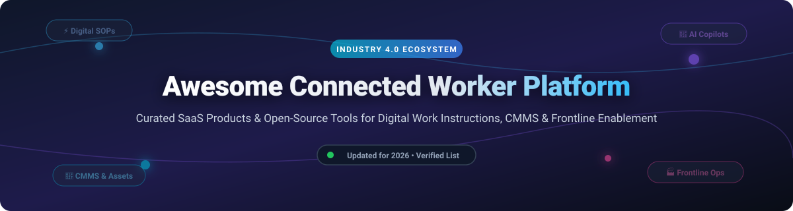
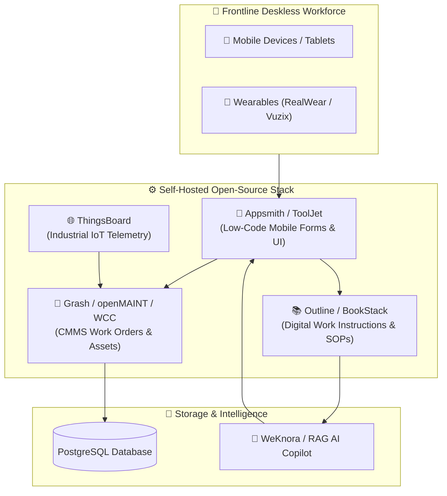

  
  
  
  
  
  

  

# 🏭 Awesome Connected Worker Platform Ecosystem

**A curated, SEO-optimized list of top SaaS products and open-source GitHub projects for connected worker platforms, digital work instructions, CMMS/EAM, and frontline workforce enablement.**

> 💡 **Language / 语言**: English | [🇨🇳 中文备份 (Chinese Version)](README_ZH.md)

---

## 📌 Table of Contents

- [📑 Overview & Key Concepts](#-overview--key-concepts)
- [🏢 Commercial SaaS Platforms](#-commercial-saas-platforms)
- [💻 Open Source GitHub Projects](#-open-source-github-projects)
  - [⭐ Top Open Source Repos (Ranked by Stars)](#-top-open-source-repos-ranked-by-stars)
- [🏗️ Recommended Architecture Blueprints](#-recommended-architecture-blueprints)
- [🤝 How to Contribute](#-how-to-contribute)
- [☕ Support & Sponsorship](#-support--sponsorship)
- [📈 Star History](#-star-history)
- [⚠️ Disclaimer](#%EF%B8%8F-disclaimer)

---

## 📑 Overview & Key Concepts

A **Connected Worker Platform (CWP)** is an enterprise software ecosystem that connects industrial deskless workers—operators, technicians, inspectors, and engineers—with real-time data, digital work instructions, AI-assisted guidance, and automated operational workflows. 

By replacing legacy paper Standard Operating Procedures (SOPs), static PDFs, and manual logbooks, CWPs empower frontline teams across manufacturing, energy, construction, automotive, and aerospace sectors to:
- ⚡ **Digitize SOPs & Work Instructions**: Build interactive step-by-step assembly, inspection, and maintenance guides.
- 🔧 **Streamline CMMS & Asset Maintenance**: Trigger preventive work orders, log equipment breakdowns, and track spare parts inventory.
- 🛡️ **Ensure Safety & EHS Compliance**: Execute digital audit trails, Gemba walks, safety checklists, and 21 CFR Part 11 GxP compliance.
- 🧠 **Capture Frontline Knowledge**: Harness AI copilot search, video SOP generation, and micro-learning modules to bridge the industrial skills gap.

---

## 🏢 Commercial SaaS Platforms

> 📊 **Market Insights**: The global Connected Worker Platform market size is estimated at **$5.2 Billion in 2026** (projected to reach $18.5 Billion by 2032 at a CAGR of ~23.5%). The sector is **moderately fragmented**, with high-growth specialized platforms (e.g., MaintainX, Tulip, Augmentir) competing alongside major industrial conglomerates (e.g., Autodesk, IFS, SymphonyAI) acquiring key players rather than a single winner-take-all monopoly.

*The table below compares leading commercial SaaS platforms, sorted by **Company Size (Valuation / Revenue) descending**.*

| Company / Product | Company Size (Valuation / Revenue) | Description & Key Capabilities | Specific Starting Price | Free Tier / Free Trial Limits |
| :--- | :--- | :--- | :--- | :--- |
| **[MaintainX](https://www.getmaintainx.com/)** 🛠️ | **$3.6B Valuation** *(Acquired by Autodesk / $135M+ ARR)* | Mobile-first workflow management & CMMS platform designed for deskless teams. Enables work order management, safety checklists, quality checks, digital audit trails, and inventory tracking. | **$19/user/month** *(Essential tier, billed annually)* | **Free Plan Available**: Free forever for unlimited work orders, up to 2 active repeating PM work orders, 1 month analytics history, and unlimited free requester accounts. |
| **[Tulip Interfaces](https://tulip.co/)** 🏭 | **$1.3B Valuation** *($120M Series D / $40M+ ARR)* | No-code connected worker and manufacturing application platform. Enables building rich-media, multi-language workflow apps connected to IoT sensors, machines, ERP, MES, and PLM systems. | **$100/interface/month** *($1,200/station/year Basic Desk tier)* | **30-Day Free Trial**: Full access to Tulip platform & app builder environment, max 5 active interfaces during trial. |
| **[Parsable](https://www.parsable.com/)** 📱 | **$350M Valuation** *(Acquired by CAI Software / $135M+ raised)* | Mobile collaboration and workflow platform built for industrial teams. Provides rich-media SOPs, digital data collection, in-app messaging, offline execution, and Microsoft Teams integration. | **$150/user/month** *(Standard connected worker license)* | **14-Day Guided Trial**: Includes builder access for 2 custom SOP procedures & 5 test user accounts. |
| **[Poka](https://www.poka.io/)** 🎓 | **$200M Valuation** *(Acquired by IFS / 1M+ active users)* | Industrial AI-driven connected worker platform featuring validated procedures, real-time skills matrix visibility, operational intelligence, and micro-learning modules to eliminate downtime. | **$18/user/month** *(Standard seat, 50-user minimum)* | **14-Day Interactive Trial**: Access to digital work instructions & skills matrix modules for up to 10 test users. |
| **[Dozuki](https://www.dozuki.com/)** 📖 | **$15M ARR** *(Marlin Equity Partners majority stake)* | Industrial documentation & SOP pioneer featuring CreatorPro AI for converting legacy manuals into digital standard work, operational workflows, and worker collaboration modules. | **$850/month** *(Standard base package, includes up to 50 users)* | **14-Day Sandbox Trial**: Includes document migration tools and authoring environment for up to 5 author seats. |
| **[Augmentir](https://www.augmentir.ai/)** 🤖 | **$50M Valuation** *($10M+ Series A / $10M ARR)* | AI-powered connected worker platform focusing on digital work instructions, AI copilot guidance, and skills management. Integrates with ERP, MES, CMMS, and QMS for 5S audits & autonomous maintenance. | **$35/user/month** *(Frontline Core tier, billed annually)* | **30-Day Enterprise Trial**: Full AI Copilot & digital workflow features enabled for up to 10 pilot users. |
| **[SwipeGuide](https://www.swipeguide.com/)** 📋 | **$40M Valuation** *(Acquired by L2L Connected Manufacturing)* | Digital work instruction and SOP platform featuring drag-and-drop instruction creation, crowdsourced frontline feedback, and mobile instruction delivery. | **$150/user/month** *(Integrated L2L Connected Operations suite)* | **14-Day Guided Trial**: Includes drag-and-drop instruction editor & QR code publishing for up to 3 operational guides. |
| **[Intoware (WorkfloPlus)](https://www.intoware.com/)** 🥽 | **$20M Valuation** *($4M ARR / RealWear partner)* | Connected worker platform providing WorkfloPlus digital workflow solutions natively integrated with industrial wearable hands-free devices (RealWear, Vuzix). | **£25 (~$33)/user/month** *(WorkfloPlus Standard license)* | **30-Day Free Trial**: Full WorkfloPlus digital workflow editor, Android wearable app support, up to 5 user seats. |
| **[Proceedix](https://www.symphonyai.com/)** ✍️ | **$10M Valuation** *(Acquired by SymphonyAI Industrial)* | Enterprise connected worker platform uniting work instructions, inspections, and training with AI Copilot contextual guidance and 21 CFR Part 11 GxP compliant signatures. | **$45/user/month** *(Digital Work Instructions core tier)* | **14-Day Trial on Request**: Access to AI Copilot inspection workflows & digital signature module for 5 test users. |
| **[REWO](https://rewo.io/)** 🎥 | **$8M Valuation** *($1.5M ARR / Viar d.o.o.)* | Visual digitalization platform for capturing tacit operational knowledge through video-based SOPs, step-by-step assembly guides, and remote field support. | **€30 (~$33)/user/month** *(Visual SOP Creator tier)* | **14-Day Free Trial**: Video procedure capture & step-by-step assembly builder for up to 3 active procedures. |

---

## 💻 Open Source GitHub Projects

Open-source tools offer self-hostable, cost-effective building blocks for manufacturing teams looking to build custom connected worker platforms, CMMS modules, low-code apps, and knowledge bases.

### ⭐ Top Open Source Repos (Ranked by Stars)

*The repositories below are sorted in **descending order by GitHub star count**.*

1. **[Outline](https://github.com/outline/outline)** 📚  
     
   Fast, collaborative team knowledge base with a modern Notion-like editor. Features real-time collaboration, nested document collections, Slack integration, and AI search capabilities. BSL 1.1 license. Ideal for authoring and distributing frontline SOPs and work instructions.

2. **[Appsmith](https://github.com/appsmithorg/appsmith)** 🚀  
     
   Leading open-source low-code platform for building custom industrial dashboards, work order dispatchers, and connected worker tools connected to PostgreSQL, MySQL, or REST APIs. Apache 2.0 license.

3. **[ToolJet](https://github.com/ToolJet/ToolJet)** ⚡  
     
   Open-source low-code framework to build internal tools and deskless worker applications. Drag-and-drop UI builder with pre-built widgets for database forms, QR code scanners, and workflow approvals. AGPL-3.0 license.

4. **[Paperless-ngx](https://github.com/paperless-ngx/paperless-ngx)** 📄  
     
   Open-source document management system that transforms physical quality checklists, compliance records, and paper SOPs into searchable, OCR-indexed digital archives. GPL-3.0 license.

5. **[ERPNext](https://github.com/frappe/erpnext)** 🏭  
     
   Comprehensive open-source ERP system featuring built-in Asset Management, Maintenance Work Orders, Quality Inspection, and Manufacturing modules. GPL-3.0 license.

6. **[Budibase](https://github.com/Budibase/budibase)** 🛠️  
     
   Open-source low-code platform for creating custom web and mobile workflows, digital inspection forms, and asset tracking portals for deskless staff. GPL-3.0 license.

7. **[Docmost](https://github.com/docmost/docmost)** 📝  
     
   Open-source Confluence/Notion alternative for team wikis. Supports real-time collaboration, document spaces, granular permission controls, and native diagramming capabilities. AGPL-3.0 license.

8. **[ThingsBoard](https://github.com/thingsboard/thingsboard)** 🌐  
     
   Open-source IoT platform for device management, data collection, processing, and visualization. Connects industrial sensors to connected worker dashboards for real-time telemetry and safety alerts. Apache 2.0 license.

9. **[BookStack](https://github.com/BookStackApp/BookStack)** 📕  
     
   Structured documentation platform organized by Shelves → Books → Chapters → Pages. Features WYSIWYG and Markdown editors, role-based access control, and full-text search. MIT license. Well-suited for non-technical teams managing operational work guides.

10. **[WeKnora (Tencent)](https://github.com/Tencent/WeKnora)** 🤖  
      
    LLM-powered enterprise knowledge framework by Tencent. Transforms raw documentation into queryable RAG systems, autonomous reasoning agents, and self-maintaining wikis. MIT license.

11. **[Grash CMMS](https://github.com/grash-io/grash)** 🔧  
      
    Free and open-source CMMS and EAM platform. Features work order management, preventive maintenance schedules, asset tracking, and spare parts inventory management. GPL-3.0 license.

12. **[openMAINT](https://github.com/tecnoteca/openmaint)** 🏙️  
      
    Open-source maintenance management system for real estate, logistics, and industrial infrastructure. Provides work order management, asset registries, barcode/QR printing, and GIS mapping. AGPL license.

13. **[WCC CMMS](https://github.com/devdave-online/WCC_CMMS)** 📴  
      
    Free, unlimited-seat CMMS featuring 34 languages, an offline Android companion app, AI agent assistance, preventive maintenance, QR printing, and reliability metrics (MTTR, MTBF). Apache 2.0 + Commons Clause.

14. **[SuperCMMS](https://github.com/SuperCMMS/Open-Source-CMMS)** 🏗️  
      
    Free open-source CMMS backend codebase providing asset management, work orders, preventive/predictive maintenance, checklists, and QR code generation.

---

## 🏗️ Recommended Architecture Blueprints

---

## 🤝 How to Contribute

Contributions are warmly welcome! Please follow these simple steps to add or update projects:

1. **Fork** this repository.
2. Edit `README.md` to add your platform or open-source tool.
3. Ensure all entries follow the format:
   - **SaaS**: Include product link, estimated company size, features, specific starting price, and exact free tier/trial limits.
   - **Open Source**: Include star count badge linking to `stargazers`, concise description, license, and maintain star-count descending order.
4. Submit a **Pull Request** with a brief summary of the changes.

---

## ☕ Support & Sponsorship

If you find this curated list valuable for your industrial digitization, smart manufacturing research, or connected worker software selection, please consider supporting the project!

- ⭐ **Star** this repository to increase visibility!
- 🔀 **Fork** and share with your team or community.
- 💖 **Sponsor / Buy me a coffee**: Support ongoing maintenance on the [GitHub Sponsor Dashboard](https://github.com/sponsors/ishandutta2007).

  

---

## 📈 Star History

---

## ⚠️ Disclaimer

- This is an independent **community-curated** list — it is neither exhaustive nor an official endorsement.
- Connected worker software platforms handle sensitive operational and workforce data; always ensure compliance with relevant data protection laws (e.g., GDPR) and industrial security standards (e.g., SOC 2, ISO 27001).
